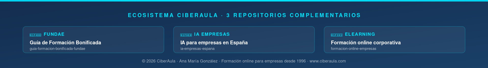

---

# Checklist técnico de evaluación de plataformas LMS

> **Resumen:** 45 puntos organizados en 8 bloques para evaluar objetivamente una plataforma LMS candidata. Cada punto está marcado con prioridad (🔴 Crítico, 🟡 Alto, 🟢 Medio) y muchos son criterios de descarte (si fallan, descartar la plataforma). Pensado para que un responsable de formación o IT sin conocimientos especializados pueda auditar cualquier LMS del mercado.

**Autora:** Ana María González · Directora de CiberAula
**Uso:** Copiar a Excel/Google Sheets. Marcar ✅ Cumple / 🟠 Parcial / ❌ No cumple / ⚪ No aplica.
**Licencia:** CC BY-SA 4.0 — libre uso con atribución

---

## Cómo usar este checklist

1. Para cada plataforma candidata, completa las 45 filas.
2. Los puntos **🔴 Críticos** son eliminatorios: si fallan, descarta la plataforma (o exige que se resuelvan antes de comprar).
3. Los puntos **🟡 Altos** son muy importantes: un par de fallos no es crítico, pero más de 3 o 4 aconsejan buscar otra plataforma.
4. Los puntos **🟢 Medios** son deseables: los usas como desempate entre finalistas similares.
5. Al acabar: cuenta los cumplimientos. La plataforma con mejor relación cumplimientos/precio gana.

---

## Bloque 1: Requisitos eliminatorios (criterios de descarte)

Sin estos puntos, la plataforma no es viable. Si alguno falla, detener el proceso.

| # | Punto | Prioridad |
|---|---|---|
| 1 | **Soporta SCORM 1.2 y SCORM 2004** de forma completa y funcional (no solo nominal). | 🔴 Crítico |
| 2 | **SLA de disponibilidad ≥ 99.5%** respaldado por contrato. | 🔴 Crítico |
| 3 | **Cumple WCAG 2.1 nivel AA**, auditado o declarado oficialmente. | 🔴 Crítico |
| 4 | **Datos alojados en la Unión Europea** o con cláusulas DPF para empresas con datos sensibles. | 🔴 Crítico |
| 5 | **Permite exportación completa de datos** en formato abierto (CSV, JSON, Excel) en cualquier momento. | 🔴 Crítico |
| 6 | **Cumple RGPD** con DPA (Data Processing Agreement) disponible y firmado. | 🔴 Crítico |

---

## Bloque 2: Cumplimiento FUNDAE (solo si formación bonificada)

Si no vas a bonificar, puedes saltarte este bloque. Si sí vas a bonificar, son obligatorios.

| # | Punto | Prioridad |
|---|---|---|
| 7 | **Identificación inequívoca del alumno** (usuario+contraseña personal e intransferible). | 🔴 Crítico |
| 8 | **Medición objetiva del tiempo efectivo** con detección de inactividad. | 🔴 Crítico |
| 9 | **Registro de todas las interacciones** (accesos, clicks, foros, evaluaciones). | 🔴 Crítico |
| 10 | **Soporte para usuario "inspector FUNDAE"** sin consumir plaza. | 🔴 Crítico |
| 11 | **Bloqueo de evaluación final** hasta completar contenido obligatorio. | 🟡 Alto |
| 12 | **Sistema integrado de comunicación alumno-tutor** (no email externo). | 🟡 Alto |
| 13 | **Emisión automática de certificados** con datos completos y código verificable. | 🟡 Alto |
| 14 | **Exportación de expedientes** en formato apto para inspección FUNDAE. | 🟡 Alto |

---

## Bloque 3: Rendimiento y fiabilidad

| # | Punto | Prioridad |
|---|---|---|
| 15 | **Soporta nº usuarios concurrentes** esperados con 3x margen (stress test documentado). | 🔴 Crítico |
| 16 | **Tiempo de carga de página < 3 segundos** en condiciones normales. | 🟡 Alto |
| 17 | **Reproducción de vídeo estable** hasta en conexiones de 4 Mbps. | 🟡 Alto |
| 18 | **Backups diarios automáticos** con política de retención documentada. | 🔴 Crítico |
| 19 | **Plan de continuidad del negocio** del proveedor con RTO < 24h. | 🟡 Alto |
| 20 | **CDN global** para distribución eficiente de contenido. | 🟢 Medio |

---

## Bloque 4: Integraciones

| # | Punto | Prioridad |
|---|---|---|
| 21 | **SSO con Microsoft 365 / Azure AD** (protocolo SAML 2.0 u OIDC). | 🟡 Alto |
| 22 | **SSO con Google Workspace** si aplica. | 🟢 Medio |
| 23 | **API REST documentada** para integraciones personalizadas. | 🟡 Alto |
| 24 | **Webhooks** para notificar eventos a otros sistemas. | 🟢 Medio |
| 25 | **Integración con RRHH** (SAP SuccessFactors, Workday, software de nóminas). | 🟡 Alto |
| 26 | **Integración con aula virtual** (Zoom, Teams, Meet) nativa, sin desarrollo adicional. | 🟡 Alto |

---

## Bloque 5: Experiencia del alumno

| # | Punto | Prioridad |
|---|---|---|
| 27 | **Interfaz en español** completa, no solo traducción parcial. | 🔴 Crítico |
| 28 | **App móvil nativa** (iOS y Android) o web responsive de calidad profesional. | 🟡 Alto |
| 29 | **Modo offline** para consumir contenido sin conexión (deseable). | 🟢 Medio |
| 30 | **Búsqueda interna** de cursos, contenido y recursos. | 🟡 Alto |
| 31 | **Notificaciones personalizables** (email, push, in-app). | 🟡 Alto |
| 32 | **Gamificación básica** (badges, progreso visual, ranking opcional) si aplica a la cultura de la empresa. | 🟢 Medio |

---

## Bloque 6: Administración y gestión

| # | Punto | Prioridad |
|---|---|---|
| 33 | **Panel de administración en español** claro y usable. | 🟡 Alto |
| 34 | **Gestión de usuarios masiva** (alta/baja por CSV, sincronización automática). | 🟡 Alto |
| 35 | **Perfiles de rol granulares** (alumno, tutor, administrador, responsable, auditor). | 🟡 Alto |
| 36 | **Catálogo estructurado** de cursos con categorías, etiquetas, búsqueda. | 🟡 Alto |
| 37 | **Itinerarios formativos** (cursos encadenados, con prerequisitos). | 🟢 Medio |
| 38 | **Informes personalizables** con exportación a PDF/Excel. | 🟡 Alto |

---

## Bloque 7: Contenido y creación

| # | Punto | Prioridad |
|---|---|---|
| 39 | **Editor de contenido nativo** para crear cursos directamente en la plataforma. | 🟢 Medio |
| 40 | **Soporte para xAPI** además de SCORM (deseable). | 🟢 Medio |
| 41 | **Soporte para LTI** para integrar herramientas externas. | 🟢 Medio |
| 42 | **Tipos de evaluación variados** (test, ensayo, tarea práctica, rúbrica). | 🟡 Alto |
| 43 | **Versionado de contenidos** para no romper expedientes al actualizar. | 🟡 Alto |

---

## Bloque 8: Contractuales y comerciales

| # | Punto | Prioridad |
|---|---|---|
| 44 | **Tope anual al aumento de precios** en el contrato. | 🟡 Alto |
| 45 | **Cláusula clara de exit strategy** con plazos y formato de entrega de datos. | 🔴 Crítico |

---

## Interpretación de resultados

Para cada plataforma candidata, cuenta:

**Cumplidos Críticos (🔴) de 15 posibles:**
- 15/15: candidato válido, pasa a evaluación por Altos.
- Menos de 15: **descartar la plataforma** o exigir resolución antes de firmar.

**Cumplidos Altos (🟡) de 20 posibles:**
- 18-20: plataforma excelente.
- 15-17: plataforma sólida, evaluar qué puntos fallan y si son aceptables.
- 10-14: plataforma dudosa, buscar alternativas.
- Menos de 10: descartar.

**Cumplidos Medios (🟢) de 10 posibles:**
- Solo usar como desempate entre finalistas.

### Recomendación final

Si tras aplicar este checklist tienes 2-3 plataformas que cumplen Críticos y suman 15+ Altos, pasa a:

1. **Prueba real de 2 semanas** con usuarios reales y contenido real.
2. **Comparativa económica** a 3 años con TCO completo.
3. **Revisión legal** del contrato por asesor especializado.
4. **Decisión documentada** con justificación escrita (útil si hay que defenderla ante auditoría o cambios de dirección).

---

## Plantilla lista para Excel

Puedes copiar esta cabecera a una hoja de cálculo y añadir las 45 filas:

| # | Bloque | Punto | Prioridad | Plataforma A | Plataforma B | Plataforma C | Notas |
|---|---|---|---|---|---|---|---|

Esta plantilla se acompaña de una versión más elaborada en [plantilla-evaluacion-lms.md](plantilla-evaluacion-lms.md) que incluye puntuación ponderada.

---

## Recursos relacionados

- 📘 [Plataformas LMS: cómo elegir la correcta](plataformas-lms-guia-elegir.md) — guía general.
- 📗 [Requisitos FUNDAE](requisitos-fundae-teleformacion.md) — normativa aplicable.
- 🔧 [SCORM, xAPI y LTI explicados](scorm-xapi-lti-explicado.md) — estándares.
- ♿ [Accesibilidad WCAG](accesibilidad-wcag-elearning.md) — cumplimiento legal.
- 📋 [Plantilla de evaluación ponderada](plantilla-evaluacion-lms.md) — matriz de decisión.

---

*Publicado bajo licencia [CC BY-SA 4.0](https://creativecommons.org/licenses/by-sa/4.0/deed.es). Libre uso con atribución a CiberAula y enlace a [www.ciberaula.com](https://www.ciberaula.com).*

*© 2026 Ana María González · Directora de CiberAula · Formación online para empresas desde 1996.*

---

### Ecosistema documental abierto de CiberAula

📘 [**Guía FUNDAE**](https://github.com/Ciberaula/guia-formacion-bonificada-fundae) · 🧠 [**IA para empresas**](https://github.com/Ciberaula/ia-empresas-espana) · 🎓 [**Formación online**](https://github.com/Ciberaula/formacion-online-empresas)

---

**CiberAula · Formación online para empresas desde 1996**

[www.ciberaula.com](https://www.ciberaula.com) · admision@ciberaula.com · 91 390 68 47 · Madrid

*Contenido bajo licencia [CC BY-SA 4.0](https://creativecommons.org/licenses/by-sa/4.0/deed.es) · Libre uso con atribución*

